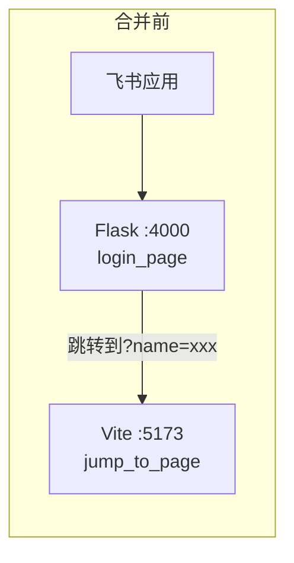
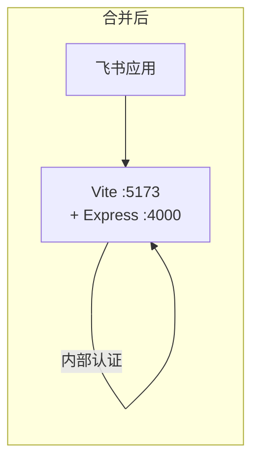
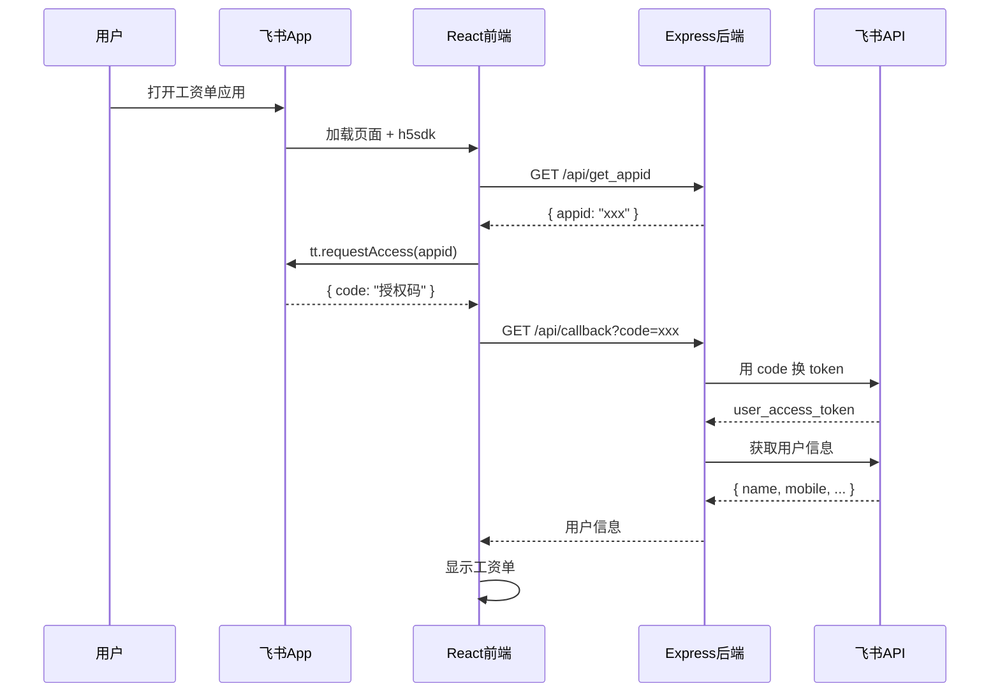

# 飞书登录集成到 React 项目 - 完成报告

## 概述

成功将 `login_page` (Flask + 飞书 OAuth) 的登录功能集成到 `jump_to_page` (Vite + React) 项目中，实现**单一应用管理**，消除了中间页跳转。

## 架构变化





---

## 新增/修改的文件

### 后端 (Node.js Express)

| 文件 | 说明 |
|------|------|
| [server.js](file:///d:/dev/feishu-login/jump_to_page/server.js) | Express 后端，提供 `/api/get_appid` 和 `/api/callback` 接口 |

### 前端 (React)

| 文件 | 说明 |
|------|------|
| [useFeishuAuth.js](file:///d:/dev/feishu-login/jump_to_page/src/hooks/useFeishuAuth.js) | 飞书认证 Hook，自动处理 OAuth 流程 |
| [feishuService.js](file:///d:/dev/feishu-login/jump_to_page/src/services/feishuService.js) | 飞书 API 服务封装 |
| [LoginLoading.jsx](file:///d:/dev/feishu-login/jump_to_page/src/components/LoginLoading.jsx) | 登录加载页组件 |

### 配置文件

| 文件 | 变更 |
|------|------|
| [vite.config.js](file:///d:/dev/feishu-login/jump_to_page/vite.config.js) | 添加 `/api` 代理配置 |
| [index.html](file:///d:/dev/feishu-login/jump_to_page/index.html) | 引入飞书 JSSDK |
| [package.json](file:///d:/dev/feishu-login/jump_to_page/package.json) | 添加 `server` 脚本 |
| [App.jsx](file:///d:/dev/feishu-login/jump_to_page/src/App.jsx) | 集成 `useFeishuAuth` 替代 URL 参数 |

---

## 如何运行

### 开发环境

```bash
# 终端 1: 启动后端
cd d:\dev\feishu-login\jump_to_page
npm run server
# 🚀 API Server running at http://localhost:4000

# 终端 2: 启动前端
npm run dev
# VITE ready at http://localhost:5173
```

### 开发环境测试结果

在非飞书环境下，自动使用模拟用户 "测试用户"：


---

## 生产部署

1. **构建前端**
   ```bash
   npm run build
   ```

2. **更新飞书应用配置**
   - 在飞书开发者后台更新网页应用主页 URL
   - 新 URL: `http://你的服务器:5173/`

3. **启动服务**
   ```bash
   # 后端 (使用 PM2 或其他进程管理工具)
   pm2 start server.js --name feishu-api
   
   # 前端 (使用 nginx 或 vite preview)
   npm run preview
   ```

---

## 认证流程



---

## 兼容性

- ✅ **飞书环境**: 自动 OAuth 认证
- ✅ **开发环境**: 模拟用户 "测试用户"
- ✅ **URL 参数**: 仍支持 `?name=xxx` 方式（向后兼容）
